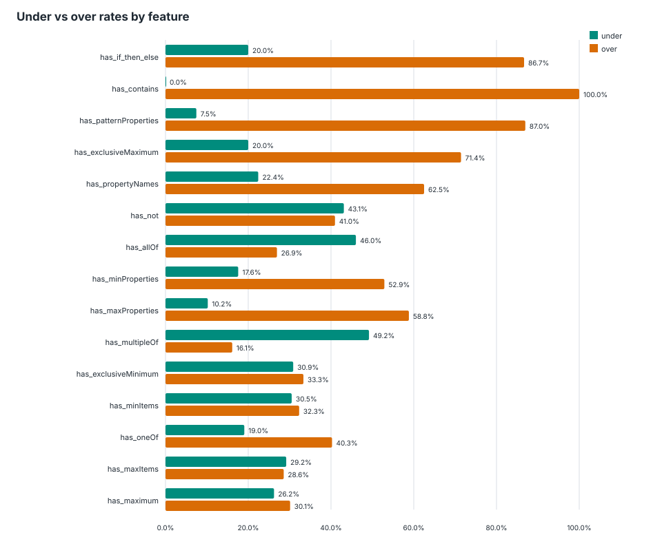
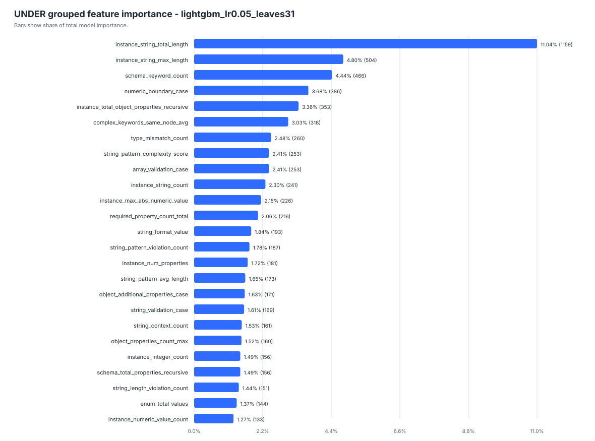
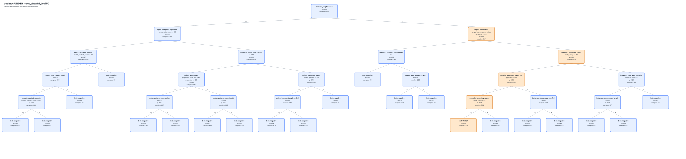

# Predicting Constraint Violations in LLM Constrained Decoding

**When do JSON-constrained decoding engines get JSON Schema wrong, and can we predict it?**

LLMs are increasingly asked to return structured JSON that must follow a given [JSON Schema](https://json-schema.org/). *Constrained decoding* frameworks enforce this by masking, at each step, the tokens that would break the schema. JSON Schema is very expressive, though, and these engines don't always get it right. This project measures, explains and **predicts** their conformance errors, test by test, for three widely used frameworks: **Guidance / LLGuidance**, **Outlines** and **XGrammar**.

> 🎓 M1 research internship at **[LIP6](https://www.lip6.fr/)** (Sorbonne Université, Faculté des Sciences et Ingénierie), 15 June – 31 July 2026
> Supervisor: **Mohammed Amine Baazizi**
> Built on top of the [JSONSchemaBench](https://github.com/guidance-ai/jsonschemabench) benchmark ([Geng et al., 2025](https://arxiv.org/abs/2501.10868))

---

## The problem

Each test pairs a JSON Schema with a JSON instance whose validity is known. We replay it through a framework's constrained decoder and compare the framework's decision with the expected one:

| Outcome | Meaning |
|---|---|
| ✅ Correct | Valid instance accepted, or invalid instance rejected |
| **UNDER**-constraint | An **invalid** instance is **accepted**: the framework is too permissive |
| **OVER**-constraint | A **valid** instance is **rejected**: the framework is too restrictive |
| ⏱️ Timeout / crash | Grammar compilation or validation doesn't finish, so there's no usable decision |

A single global accuracy score hides *which* constraints fail and *in which context*. The goal was to go further. We wanted to find the schema and instance configurations that trigger UNDER and OVER errors, and to check whether those errors can be **predicted on schemas the model has never seen**.

## What I built

1. **Test-level execution harness.** It replays every schema–instance pair through each framework and logs the decision, the expected validity and any errors. It covers ≈ 76,000 framework × test decisions over the GitHub subsets of JSONSchemaBench (trivial → ultra) and Kubernetes.
2. **Profiling and robust long runs.** It times each stage separately (grammar compilation, tokenization, token-by-token validation, and for Outlines, regex → index → guide). A per-schema timeout, resumable checkpoints and supervision let the runs survive crashes on a shared server.
3. **Exploratory analysis and feature engineering.** I engineered hundreds of schema and instance features: numeric bounds and boundary cases, object structure and `additionalProperties`, regex and `patternProperties`, `allOf/anyOf/oneOf/not` combinators, and schema × instance interactions. Risk is analysed with support and lift, at both the test level and the schema level.
4. **Predictive models.** One classifier per *framework × error type*, comparing Logistic Regression, Random Forest, HistGradientBoosting and LightGBM. Train, validation and test splits are **grouped by `schema_id`**, so every test of a given schema lands in exactly one split. Features are then filtered by importance and domain knowledge, and the models are retrained on the reduced feature lists.
5. **Interpretable rules.** Shallow decision trees turn the risky configurations into human-readable rules.
6. **Out-of-distribution evaluation.** The GitHub-trained models are applied **without retraining** to Kubernetes schemas.

## Results

### Predicting errors on unseen schemas (held-out test split, grouped by schema)

| Framework | Error | Model | Precision | Recall | F1 | ROC-AUC | PR-AUC |
|---|---|---|---:|---:|---:|---:|---:|
| Outlines | UNDER | LightGBM | 0.96 | 0.75 | **0.84** | **0.99** | 0.94 |
| Outlines | OVER | Random Forest | 0.89 | 0.74 | **0.81** | 0.90 | 0.84 |
| Guidance | OVER | Random Forest | 0.71 | 0.87 | **0.78** | 0.84 | 0.86 |
| XGrammar | UNDER | Random Forest | 0.71 | 0.78 | **0.74** | 0.95 | 0.83 |
| XGrammar | OVER | Random Forest | 0.78 | 0.70 | **0.74** | 0.93 | 0.81 |

Guidance produced **no UNDER errors** at all in the modeling data, so there was nothing to learn for that target.
A 5-fold cross-validation grouped by schema, run with earlier feature lists, gives ROC-AUC between 0.84 and 0.96 across the five models.
✅ **Reproducible:** reloading the saved models and re-running `predict_proba` on the test split gives exactly the reported scores (see the notebook).

### What drives the errors

<p align="center">
  
  <br/><em>XGrammar: UNDER rate among invalid instances and OVER rate among valid instances, for schemas that use each keyword. Keywords such as <code>contains</code>, <code>if/then/else</code> and <code>patternProperties</code> mostly lead to over-restrictive rejections.</em>
</p>

<p align="center">
  
  <br/><em>Outlines UNDER (LightGBM): instance string lengths, schema complexity and numeric boundary cases carry most of the signal.</em>
</p>

**Example of an extracted rule (Outlines UNDER).** When numeric constraints are nested (depth ≥ 2) and the tested number sits on or outside a bound (other than exactly the minimum), Outlines accepts the invalid instance. On held-out schemas, this rule has **90.7% precision** and covers **61.5%** of Outlines UNDER errors.

<p align="center">
  <a href="docs/figures/outlines_under_decision_tree.svg"></a>
  <br/><em>Shallow decision tree used to extract the Outlines UNDER rules (click to enlarge).</em>
</p>

### Generalization to Kubernetes schemas (no retraining)

- **Guidance OVER** transfers well: F1 0.77, recall 0.86.
- **XGrammar and Outlines OVER** keep a very high precision (0.99–1.00), but their recall drops to 0.23–0.37. The Kubernetes schemas trigger error patterns that are rare in the GitHub data, which is a clear case of distribution shift.
- UNDER couldn't be evaluated on Kubernetes, because neither XGrammar nor Outlines produced any UNDER error there.

## Repository structure

```text
.
├── README.md
├── requirements.txt
├── setup_benchmark.sh                 # downloads JSONSchemaBench/MaskBench + applies the patch
├── patches/
│   └── outlines_engine_offline_vocabulary.patch
├── docs/
│   ├── figures/                       # figures used in this README
│   └── internship_presentation.pptx   # internship defense slides
└── extension_jsonschemabench/         # all the internship work
    ├── README.md                      # detailed documentation (French)
    ├── visualisation_etudes_frameworks.ipynb          # main results notebook (executed)
    ├── visualisation_etudes_frameworks_grouped.ipynb  # EDA plots per framework (executed)
    ├── scripts/                       # runners, profiling, feature extraction, modeling, rules
    ├── results/per_dataset_runs/      # per framework × dataset summaries and plots
    └── coverage_prediction/
        ├── modeles_predictifs/        # final models, modeling tables, metrics, feature importance
        ├── feature_documentation/     # definition of every feature
        ├── feature_filter/            # feature selection audit
        ├── rules/                     # decision trees and extracted rules
        ├── external_eval/Kubernetes/  # GitHub models applied to Kubernetes
        └── kubernetes_eval/           # models trained and tested on Kubernetes
```

The benchmark itself (`data/`, `maskbench/`) isn't copied into this repository. It belongs to its authors, and `setup_benchmark.sh` downloads it.

## Getting started

```bash
git clone https://github.com/wafaaBerrais/stageM1.git
cd stageM1
python -m venv .venv && source .venv/bin/activate   # Windows: .venv\Scripts\activate
pip install -r requirements.txt

# Browse the results: no benchmark download needed
jupyter notebook extension_jsonschemabench/visualisation_etudes_frameworks.ipynb
```

To re-run the frameworks or rebuild the features from scratch:

```bash
./setup_benchmark.sh                        # fetches data/ and maskbench/ (guidance-ai/jsonschemabench)
pip install -r maskbench/requirements.txt   # Guidance/LLGuidance, Outlines, XGrammar, transformers, torch
```

Every script is described in [`extension_jsonschemabench/scripts/README.md`](extension_jsonschemabench/scripts/README.md). The saved models require **scikit-learn 1.9.0**. Raw per-test logs (`per_test_results.jsonl`) aren't included because of their size, but the `run_*` scripts regenerate them.

## Tech stack

Python · scikit-learn · LightGBM · NumPy · jsonschema · Jupyter · Guidance/LLGuidance · Outlines · XGrammar · Hugging Face Transformers

## Acknowledgements

This work extends **JSONSchemaBench** and **MaskBench**:

> Saibo Geng et al. *JSONSchemaBench: A Rigorous Benchmark of Structured Outputs for Language Models.* arXiv:2501.10868, 2025. [[paper]](https://arxiv.org/abs/2501.10868) [[code]](https://github.com/guidance-ai/jsonschemabench)

Thanks to Mohammed Amine Baazizi for supervising this internship at LIP6.

## Author

**Wafaa Berrais**, Master's student in Artificial Intelligence, Machine Learning & Data
GitHub: [@wafaaBerrais](https://github.com/wafaaBerrais)
